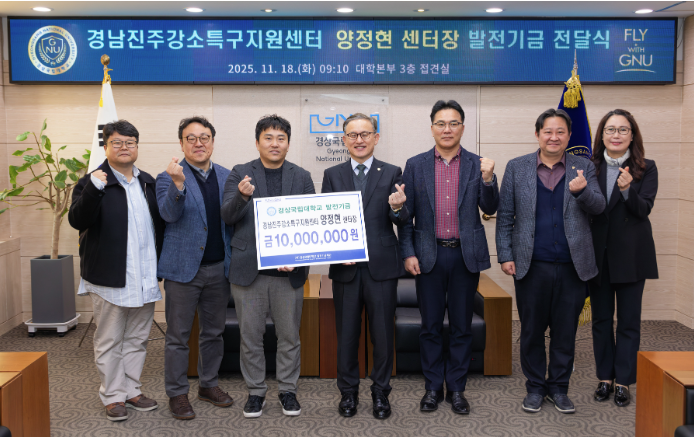

양정현 교수가 경상국립대학교 부임 10주년을 맞아 대학 발전기금 1,000만 원을 기부했습니다.
발전기금 전달식은 11월 18일 대학본부 3층 접견실에서 권진회 총장과 대학 관계자 10여 명이 참석한 가운데 열렸습니다.
이번 기부를 포함해 지금까지 총 1,133만 원의 발전기금을 출연했습니다.

> "경상국립대학교의 발전은 교수와 학생, 지역사회가 함께 만들어가는 결과물이라 생각합니다.
> 대학의 연구력 강화와 창의적 인재 양성에 조금이나마 보탬이 되기를 바랍니다."

출처: [기계시스템공학과 학부자료실](https://www.gnu.ac.kr/gse/na/ntt/selectNttInfo.do?mi=3477&bbsId=1545&nttSn=4452522) ·
[경상국립대학교 보도자료](https://www.gnu.ac.kr/main/na/ntt/selectNttInfo.do?mi=1070&nttSn=4393305)
