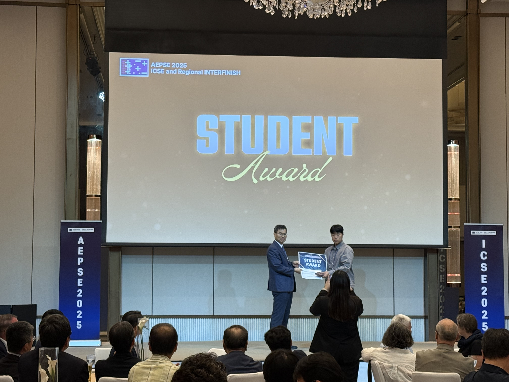
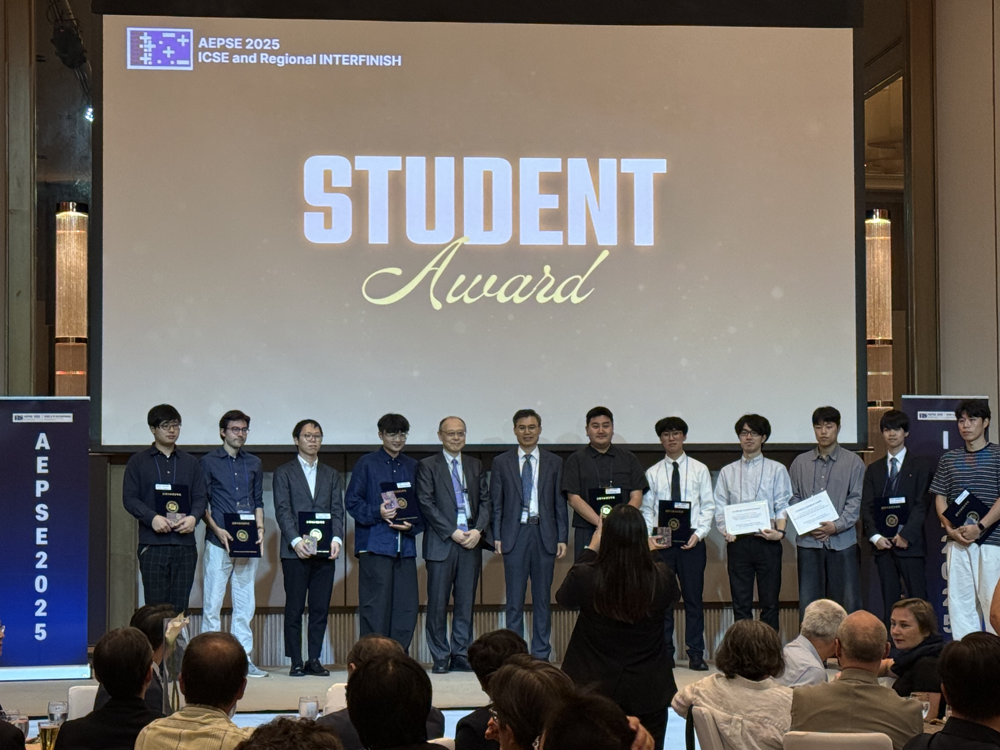
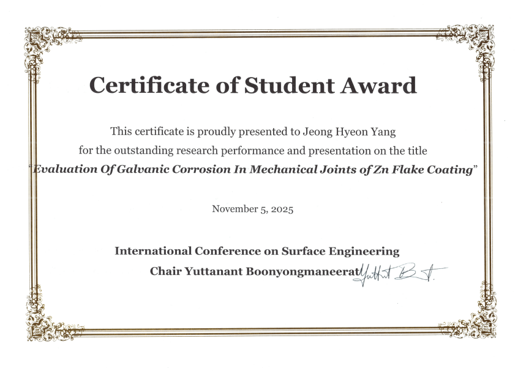

석사과정 우ㅇ훈 학생이 **AEPSE 2025 (ICSE and Regional INTERFINISH)** 국제학회에서 **Student Award**를 받았습니다 (2025년 11월 5일).

- 발표 제목: *Evaluation of Galvanic Corrosion in Mechanical Joints of Zn Flake Coating*
- 학회: International Conference on Surface Engineering (ICSE), AEPSE 2025

출처: [기계시스템공학과 학부자료실](https://www.gnu.ac.kr/gse/na/ntt/selectNttInfo.do?mi=3477&bbsId=1545&nttSn=4452763)
