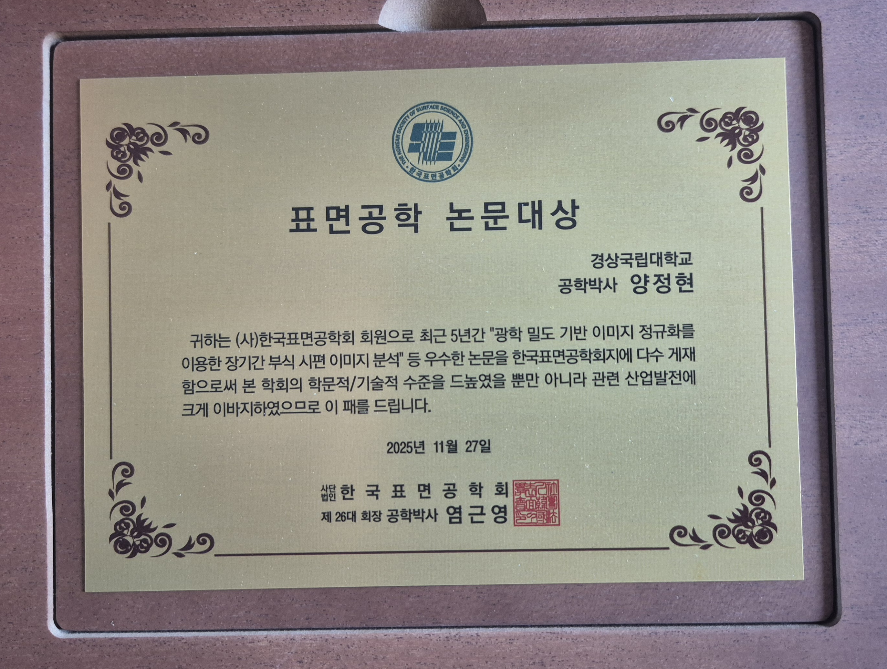
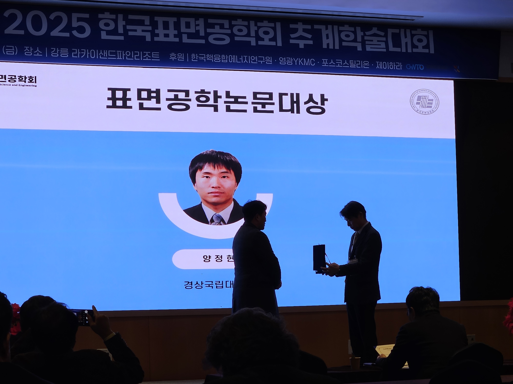

양정현 교수가 (사)한국표면공학회로부터 **표면공학 논문대상**을 받았습니다 (2025년 11월 27일).

최근 5년간 「광학 밀도 기반 이미지 정규화를 이용한 장기간 부식 시편 이미지 분석」 등 우수한 논문을 한국표면공학회지에 다수 게재하여 학회의 학문적·기술적 수준을 높이고 관련 산업 발전에 이바지한 공로입니다.

출처: [기계시스템공학과 학부자료실](https://www.gnu.ac.kr/gse/na/ntt/selectNttInfo.do?mi=3477&bbsId=1545&nttSn=4607261)
