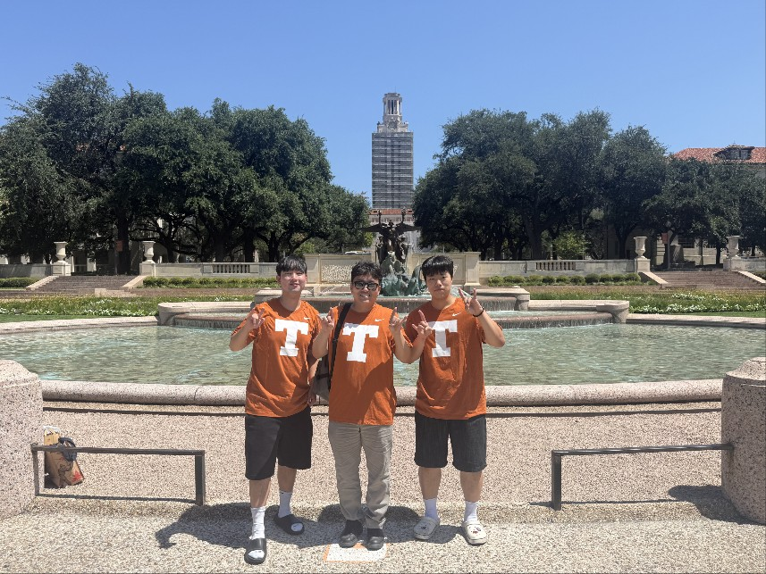

경상국립대 실험실창업탐색팀 13명이 미국 텍사스대 오스틴(UT Austin)에서 현지 고객을 직접 만나 실험실 기술의 시장성을 검증했습니다.
경상국립대 실험실창업혁신단은 7개 실험실창업탐색팀이 UT Austin 해외실전교육 **'KIC TeX-Corps Program 2026'** 전 과정을 수료했다고 밝혔습니다.

이 프로그램은 과학기술정보통신부 '공공기술기반 시장연계 창업탐색지원 사업'의 일환으로, 고객을 직접 만나 사업 가설을 검증하는 린스타트업 방식으로 진행됐습니다.
참가팀은 현지 잠재 고객·산업 관계자 인터뷰(B2B·B2G 30건, B2C 50건 기준)와 3차례의 'Lessons Learned' 발표, 4차례의 전담 멘토링을 거쳐 목표시장과 가치제안, 글로벌 시장진입 전략을 구체화했습니다.

> **MLC팀 예비창업대표 우ㅇ훈(대학원 기계시스템공학전공)**
> "실험실에서 연구하던 **영상 기반 금속 부식 진단 및 수명예측 기술**을 시장과 고객의 관점에서 새롭게 바라보는 계기가 됐습니다. 미국 현지 전문가와 잠재 고객을 직접 만나 기술의 적용 가능성을 검증하고, 글로벌 사업화 방향을 구체화할 수 있었던 뜻깊은 시간이었습니다."

출처: [기계시스템공학과 학부자료실](https://www.gnu.ac.kr/gse/na/ntt/selectNttInfo.do?mi=3477&bbsId=1545&nttSn=8078503) ·
[경남도민신문](http://www.gndomin.com/news/articleView.html?idxno=483817) ·
[데일리한국](https://daily.hankooki.com/news/articleView.html?idxno=1390447)
